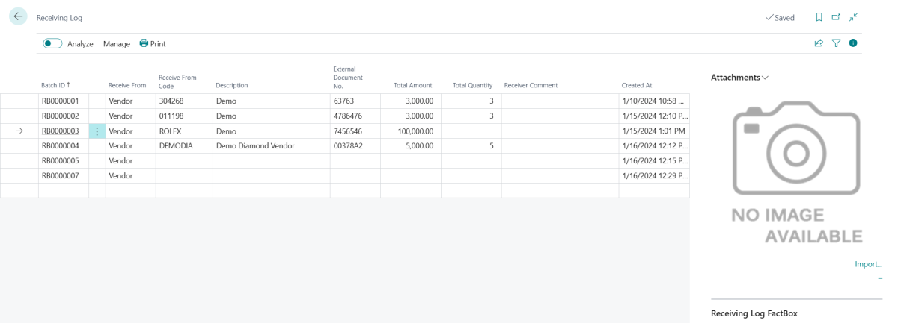

# Receiving Log Entry

## Using The Receiving Log

1. Choose the  icon, enter **Receiving Log**, and then choose the related link.  
2. On the **Receiving Log** page, click on the next empty row. In the **Receive From** field, choose **Vendor** or **Customer**.
3. In the **Receive From Code** field, enter the Vendor or Customer Code. (list will be different based on if you choose Vendor or Customer)
4. The **Description** field will auto populate from the selected Vendor or Customer Name.
5. In the **External Document No.** field, enter your reference number. (Example - vendor invoice number packing list number or memo number)
6. In the **Total Amount** field, enter an amount.
7. In the **Total Quantity** field, enter a quantity( not manditory field).
8. In the **Receiver Comment** field, record a comment if needed.
9. On the **FactBox** pane, under **Attachments** click on import and attach the corresponding document that goes with this entry.

> [!TIP]
> You can collapse or expand the **FactBox** by clicking on the **!** icon on the top right of the window.

