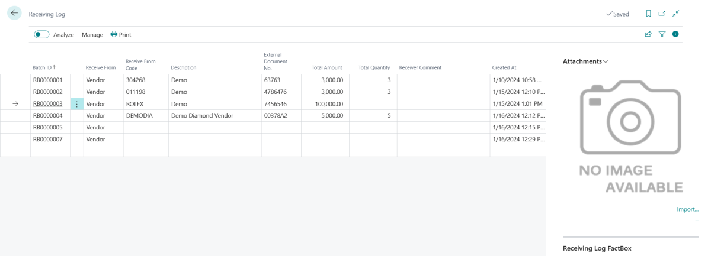

# Receiving Log Entry

## Using The Receiving Log

1. Choose the  icon, enter **Receiving Log**, and then choose the related link.  
2. On the **Receiving Log** page, click on the 3 dots next to **Batch ID** then click on **New Line**, or click on the next empty row. 
1. In the **Receive From** field, choose **Vendor** or **Customer**.
1. In the **Receive From Code** field, enter the Vendor or Customer Code. (list will be different based on if you choose Vendor or Customer)
1. The **Description** field will auto populate from the selected Vendor or Customer Name.
1. In the **External Document No.** field, enter your reference number. (Example - vendor invoice number packing list number or memo number)
1. In the **Total Amount** field, enter an amount.
1. In the **Total Quantity** field, enter a quantity( not mandatory field).
1. In the **Receiver Comment** field, record a comment if needed.
1. Click on **Print**, then click **Print** again to print out a label.
1. Attach label to Documents.

> [!TIP]
> You can use the import function under attachments to take a photo of inside the box to keep for your records.

